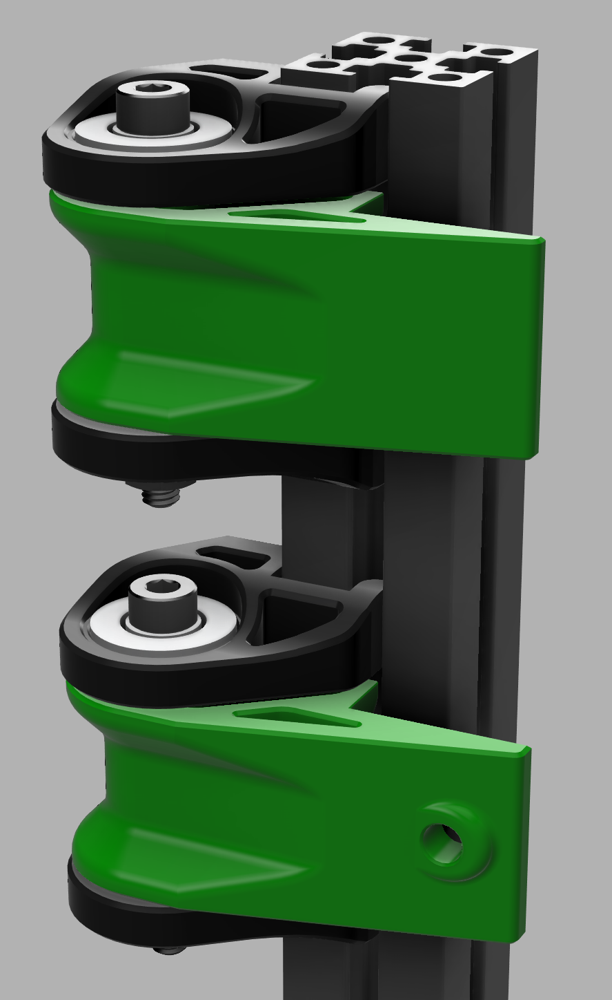

 

  <h3 align="center">1515 Annex Hinges</h3>

  

    Even ants need cool hinges
     
     
  

## Summary

  

Scaled down annex hinges for 1515 extrusions.
Both LDO and Makerbeam style extrusions are supported.  Hinge arms to support using either 1mm or 3mm foam
Door panel attachment to the hinges via VHB or Screw.

## BOM (Per Hinge)
 - 2 F623 Bearings
 - 1 M3x30 screw
 - 4 M3x6 SHCS screw
 - 3 M3 nuts.  (locknut recommended for hinge pin screw)
 - 2 M3 washer to serve as shims (.5 or 1mm are acceptable)

## Credits:
* [Annex Engineering](https://github.com/Annex-Engineering)

